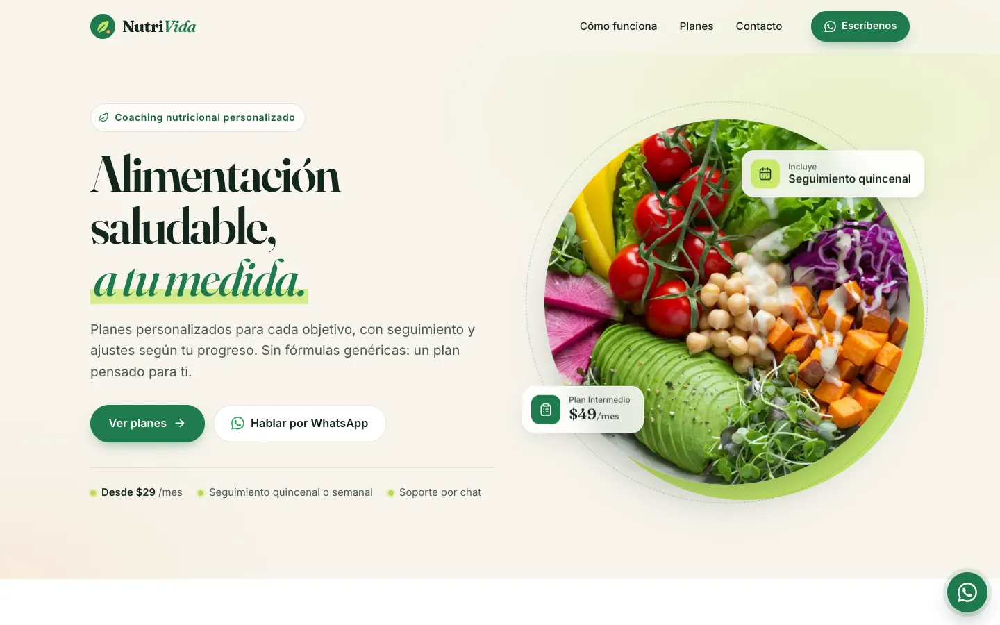
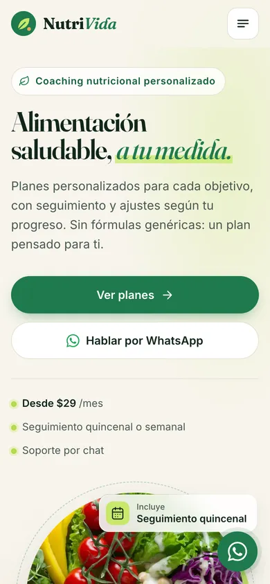

# NutriVida — Planes de nutrición personalizados

Landing page de una página para **NutriVida**, un servicio de coaching nutricional que convierte por WhatsApp.

**Demo en vivo:** https://gustavolarcodev.github.io/NutritionLife/

<p>
  
  
</p>

## Características

- **Landing responsive de una sola página**: hero, «Cómo funciona», planes, contacto y footer. Probada a 360, 390, 768 y 1440 px sin scroll horizontal.
- **Planes y precios**: Básico ($29/mes), Intermedio ($49/mes, destacado) y Avanzado ($79/mes). Cada tarjeta abre WhatsApp con un mensaje ya escrito para ese plan.
- **Generador de mensajes de WhatsApp**: el formulario (nombre, teléfono opcional, plan y objetivo) arma el mensaje, lo muestra en vista previa en vivo y abre `wa.me` con el texto codificado. Valida en línea (`aria-invalid`, mensajes de error y estado `aria-live`), sin `alert()`. Si el navegador bloquea la ventana emergente, abre WhatsApp en la misma pestaña.
- **Accesibilidad**: landmarks semánticos, enlace «Saltar al contenido», un solo `h1` con jerarquía correcta, foco visible, contraste AA, objetivos táctiles de 44 px y menú móvil accesible (`aria-expanded`, cierre con Esc).
- **Movimiento con criterio**: animaciones de entrada con IntersectionObserver y tarjetas flotantes. Todo se desactiva con `prefers-reduced-motion`, y el contenido se ve igual sin JavaScript.
- **SEO**: título y descripción, canonical, Open Graph/Twitter con imagen 1200×630, favicon SVG, `apple-touch-icon` y JSON-LD `ProfessionalService` con los planes.
- **Rendimiento**: sin frameworks ni build. Imágenes locales en WebP con `srcset` y dimensiones explícitas, precarga de la imagen principal, carga diferida fuera de pantalla e iconos SVG inline. La primera carga pesa unos 370 KB.

## Stack

HTML semántico, CSS propio (custom properties, grid, `clamp()`) y JavaScript vanilla. Tipografías: Fraunces e Inter (Google Fonts).

## Estructura

```
index.html        # marcado, sprite de iconos SVG, meta/SEO
styles.css        # sistema de diseño y estilos
main.js           # menú, animaciones, botón flotante, formulario → WhatsApp
assets/img/       # fotos WebP/JPG, og-image, favicon, apple-touch-icon
docs/             # capturas para este README
```

## Ejecutar en local

```bash
python3 -m http.server 8000
# abre http://localhost:8000
```

Se publica con GitHub Pages desde la raíz de la rama principal. Todas las rutas son relativas.

## Créditos

Fotografías de [Unsplash](https://unsplash.com) (Licencia de Unsplash): bowl de ensalada (`photo-1512621776951`) y clase de entrenamiento (`photo-1518310383802`).

---

### English summary

Single-page, responsive landing page for NutriVida, a nutrition coaching service. It has three pricing plans, and each plan's call to action opens WhatsApp with a prefilled message. A WhatsApp message builder form includes live preview and inline, accessible validation. It is built with plain HTML, CSS and vanilla JS: no framework and no build step. It uses self-hosted WebP images and supports reduced motion. SEO covers Open Graph and JSON-LD. The site is deployed on GitHub Pages.
